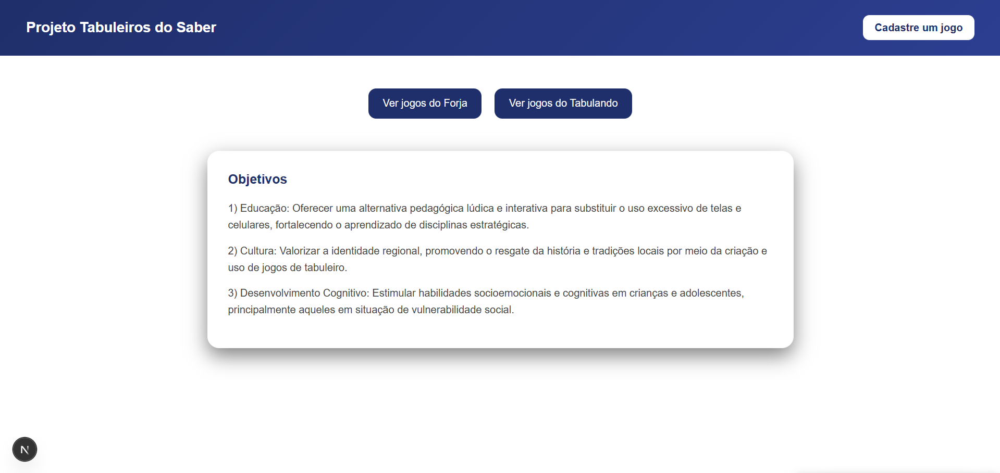
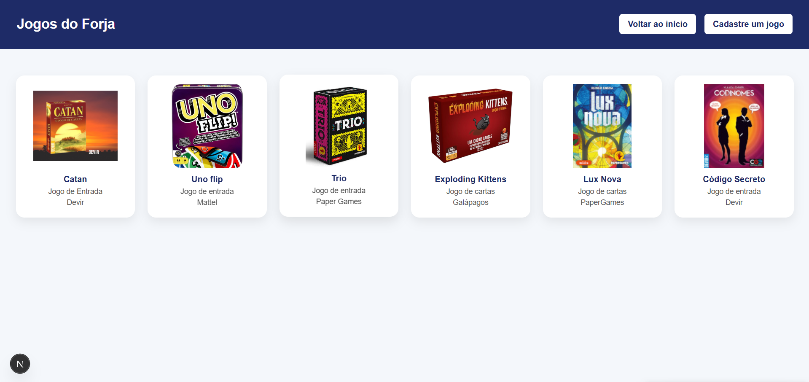
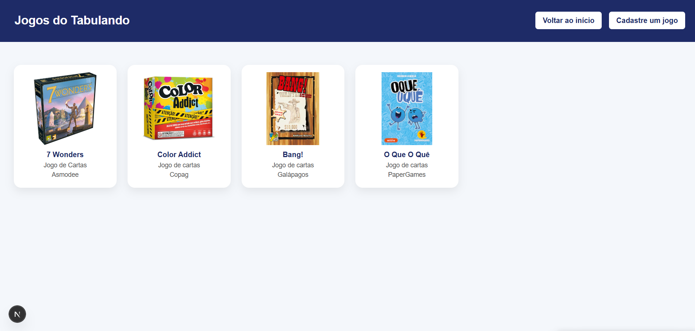
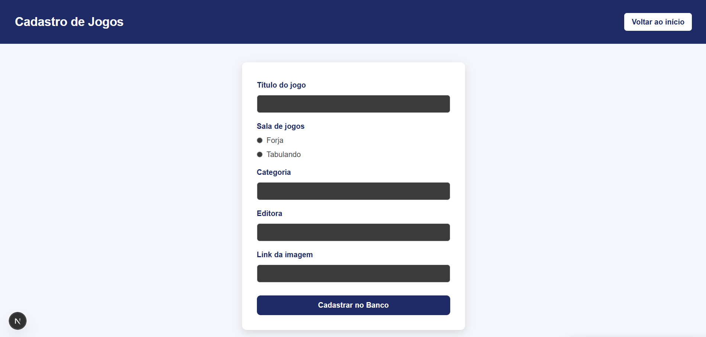

Esse é um projeto [Next.js](https://nextjs.org) com [`create-next-app`](https://nextjs.org/docs/app/api-reference/cli/create-next-app).

# Tabuleiros do Saber
Esse site partiu de um projeto que participo chamado "Tabuleiros do Saber", esse site engloba as duas salas de jogos do IFCE, campus Jaguaruana e Aracati, e tem como objetivo ser uma exposição dos jogos que existem nas duas salas.

## Descrição do projeto
Esse projeto possue as seguintes funcionalidades:
- Cadastrar jogos;
- Mostrar jogos da sala.

## Tecnologias utilizadas
- Frame-Work:

    [](https://skillicons.dev)

- FrontEnd:

    [](https://skillicons.dev)

- BackEnd:

    [](https://skillicons.dev)

- Banco de dados:

    [](https://skillicons.dev)

- Hospedagem e controle de versão:

    [](https://skillicons.dev)

## Designe do projeto
**Página inicial**


**Página da sala de jogos de Jaguaruana**


**Página da sala de jogos de Aracati**


**Página de cadastro de jogos**


## APIs utilizadas
**cadastrarJogo:** Pega as informações do endPoint ``/api/cadastrarJogo`` e envia para o banco no formato SQL.

**jogos:** através do endPoint ``http://localhost:3000/api/jogos?id_sala=${id}`` localiza e requisita os jogos no banco de dados que tem os id_sala iguais ao id repassado na página inicial, após clicar em alguma das salas de jogos, e transforma os dados do formato SQL para Json.

**salas:** através do endPoint ``http://localhost:3000/api/salas?id=${id}`` localiza e requisita as salas no banco de dados que tem o id igual ao id repassado na página inicial, após clicar em alguma das salas de jogos, e transforma os dados do formato SQL para Json.

## EndPoints do projeto
**Exemplo de endPoint:** ``http://localhost:3000/api/jogos?id_sala=${id}``

**Exemplo de Resposta:**
```json
[
    {
        "categoria": "Jogo de Entrada",
        "editora": "Devir",
        "id_jogo": 2,
        "id_sala": 1,
        "linkimagem": "https://devir.com.br/wp-content/uploads/2021/01/imagem-destaque-site-2.png",
        "titulo": "Catan"
    },
    {
        "categoria": "Jogo de entrada",
        "editora": "Mattel",
        "id_jogo": 4,
        "id_sala": 1,
        "linkimagem": "https://http2.mlstatic.com/D_Q_NP_767930-MLA96896910512_112025-F.webp",
        "titulo": "Uno flip"
    },
    {
        "categoria": "Jogo de entrada",
        "editora": "Paper Games",
        "id_jogo": 5,
        "id_sala": 1,
        "linkimagem": "https://encrypted-tbn0.gstatic.com/images?q=tbn:ANd9GcSAQlGDN_EbWcWNEawn9o1RPrPo3eamgfQpTA&s",
        "titulo": "Trio"
    },
    {
        "categoria": "Jogo de cartas",
        "editora": "Galápagos",
        "id_jogo": 6,
        "id_sala": 1,
        "linkimagem": "https://m.media-amazon.com/images/I/71wWeRHMiPL._AC_SX679_.jpg",
        "titulo": "Exploding Kittens"
    }
]
```

**Exemplo de endPoint:** ``http://localhost:3000/api/salas?id=${id}``

**Exemplo de Resposta:**
```json
[
    {
        "campus": "Aracati",
        "id": 2,
        "nome": "Tabulando",
        "responsavel": "Andressa Bezerra"
    }
]
```

**Exemplo de endPoint:** ``/api/cadastrarJogo``

**Exemplo de Resposta:** Cadastra os dados no banco de dados a partir do método POST utilizando um formulário como forma de coleta de dados.

## Como executar o Back-end do projeto

**1. Clonar o projeto ou baixar os arquivo para a sua máquina.**

**2. Instalar as dependências executando o comando abaixo:**

```
npm i pg
```

**3. Executar o servidor com os comandos:**

```
npm run dev
``` 

## Funcionalidades
- [x] Cadastrar jogo;
- [x] Mostrar jogos;
- [ ] Pesquisar jogo;
- [ ] Excluir jogo;
- [ ] Autenticação.

## Implementações futuras
- Melhorar o FrontEnd.
- Tornar o site responsivo.
- Função de excluir jogo.
- Autenticação.
- 

##  Contatos:
Caso queira me pagar algum valor, primeiro me contate em algum desses, para que eu mande uma chave pix aleatória😁.
- Email: guilhermerochasilva019@gmail.com
- LinkedIn: https://www.linkedin.com/in/guilherme-rocha-080831323/
- GitHub: https://github.com/GuiEmanuel